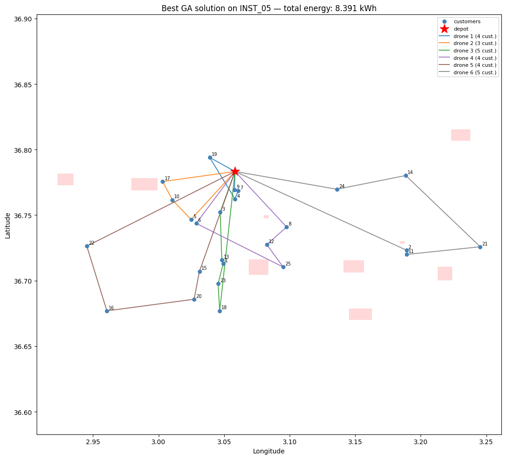
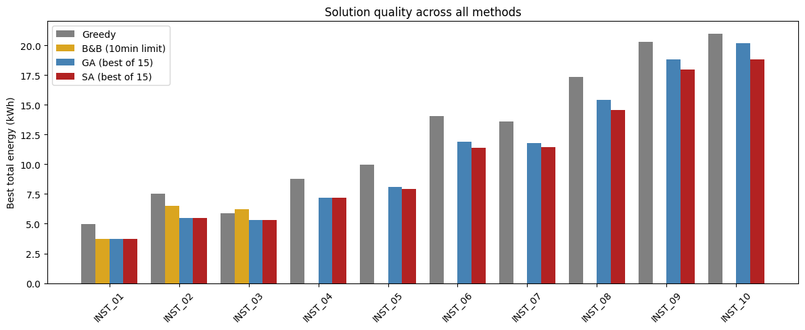
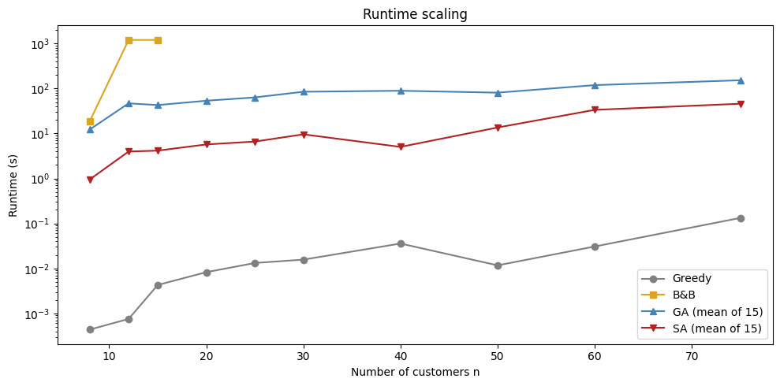
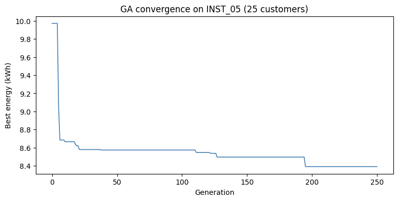
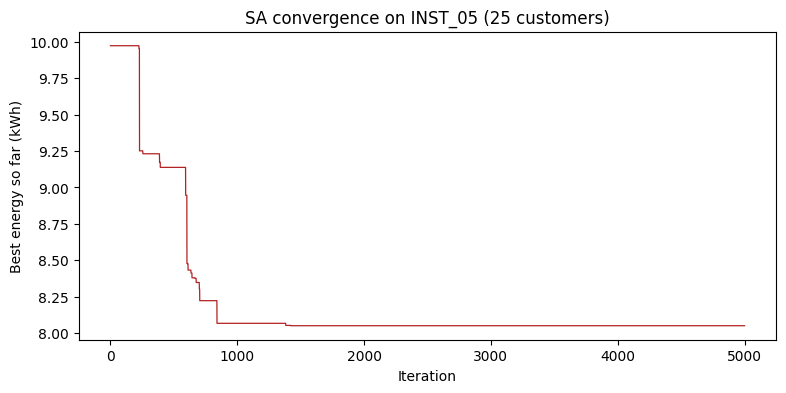

# Drone-Based Delivery Optimization over Algiers

[](https://github.com/Abdelmalek05/Drone-Based-delivery-optimization/actions/workflows/tests.yml)
[](pyproject.toml)
[](LICENSE)

**[▶ Interactive presentation](https://nmo-presentation.vercel.app/)** · [Notebook](notebook.ipynb) · [Results](#results)

Energy-optimal routing for a fleet of delivery drones flying out of the Port of Algiers, under battery,
payload, and no-fly-zone constraints. Four solvers — a greedy heuristic, an exact branch and bound, a
genetic algorithm, and simulated annealing — are implemented from scratch and compared on 10 benchmark
instances (8 to 75 customers) with a proper experimental protocol: 15 seeded runs per metaheuristic,
confidence intervals, a Wilcoxon signed-rank test, and an equal-wall-clock comparison.



*Six drones serving 25 customers around Algiers. Red star = depot, pink boxes = no-fly zones.*

---

## The problem

A logistics operator runs `K` identical drones from one depot. Each customer `i` has a demand `q_i` (kg).
A drone may carry at most `Q = 5 kg`, holds `B = 5 kWh` of battery, and consumes energy as a **linear
function of the payload it is currently carrying**:

```
E(leg i→j) = d_ij · (α + β · payload_carried)      α = 0.044 kWh/km,  β = 0.008 kWh/km/kg
```

Because payload drops at every delivery, the cost of a leg depends on **where in the route it sits** —
this is what separates the problem from a plain distance-minimising VRP, and it is why energy, not
distance, is the objective. Certain city areas (military zones, aerodromes, power plants) are no-fly
zones; edges crossing them are forbidden outright.

**Objective:** minimise total energy consumed by the fleet, with every customer served exactly once,
every route starting and ending at the depot, and no route exceeding `Q`, `B`, or entering a NFZ.

The problem is NP-hard — with `K = 1`, unlimited payload and battery, and `β = 0`, it reduces to the
Travelling Salesman Problem. The notebook gives two independent formulations: an **arc-based MILP**
(binary arc variables + payload-flow variables + MTZ subtour elimination) and a **flow-based** one.

## Methods

| Solver | Type | Idea |
|---|---|---|
| **Greedy** | Constructive | Nearest reachable customer per drone. Baseline, plus the seed for SA and GA. |
| **Branch & Bound** | Exact | Depth-first, append-only branching with `K!`-symmetry breaking. Admissible bound: committed energy + cheapest in/out arc per unvisited customer, costed at `α` only. Wall-clock limited. |
| **Genetic Algorithm** | Population | Permutation chromosome decoded into routes; OX crossover, mixed mutation, tournament selection, elitism, 2-opt local search after crossover (memetic), greedy seeding. |
| **Simulated Annealing** | Local search | Geometric cooling (`γ = 0.995`), neighbourhood of relocate / 2-opt / swap-between-routes moves. |

All four share the same `Instance` / `Route` / `Solution` model and funnel every candidate through a
`Repairer` that de-duplicates visits, trims infeasible routes, and cheapest-inserts missing customers —
so operators are free to produce broken solutions.

## Results

Best energy found (kWh, lower is better) across all 10 instances:

| Instance | n | K | Greedy | B&B | GA (best of 15) | SA (best of 15) | Best vs greedy |
|---|---:|---:|---:|---:|---:|---:|---:|
| INST_01 | 8 | 3 | 4.951 | **3.743** ✓ proven optimal | 3.743 | 3.743 | −24.4% |
| INST_02 | 12 | 4 | 7.553 | 6.493 ⏱ | **5.466** | **5.466** | −27.6% |
| INST_03 | 15 | 5 | 5.897 | 6.201 ⏱ | **5.323** | **5.323** | −9.7% |
| INST_04 | 20 | 7 | 8.799 | — | **7.160** | **7.160** | −18.6% |
| INST_05 | 25 | 8 | 9.973 | — | 8.067 | **7.936** | −20.4% |
| INST_06 | 30 | 10 | 14.024 | — | 11.878 | **11.356** | −19.0% |
| INST_07 | 40 | 13 | 13.588 | — | 11.789 | **11.463** | −15.6% |
| INST_08 | 50 | 16 | 17.337 | — | 15.419 | **14.583** | −15.9% |
| INST_09 | 60 | 19 | 20.302 | — | 18.799 | **17.951** | −11.6% |
| INST_10 | 75 | 24 | 20.985 | — | 20.180 | **18.831** | −10.3% |

✓ proven optimal · ⏱ hit the 20-minute limit · — skipped (n > 15, hopeless within budget)

**What the experiments show**

- **The metaheuristics beat greedy by 10–28%**, and the gap is largest on the small and medium instances
  where a bad first decision is expensive.
- **B&B proves optimality only at n = 8.** At n = 12 and 15 it exhausts 20 minutes and returns a solution
  *worse* than what SA finds in 4 seconds — a concrete illustration of why exact methods are abandoned here.
- **SA dominates GA on the larger instances** (Wilcoxon signed-rank over the 10 paired instances:
  W = 0.0, p = 0.031, significant at 5%) — and it gets there several times faster: 46 s mean per run on
  INST_10 versus 152 s for the GA, and 3–13× faster depending on the instance.
- Under an **equal wall-clock budget** the ranking holds (INST_08, 40 s each: SA 14.998 kWh vs GA 17.157),
  so SA's advantage is not merely a per-iteration cost artefact. (Equal-time results depend on the
  machine — a faster CPU fits more iterations into the same budget — so re-running shifts these two
  numbers; the cached best-of-15 results above are hardware-independent.)

| | |
|---|---|
|  |  |
| Best energy by method and instance | Runtime scaling with instance size (log scale) |
|  |  |
| GA convergence on INST_05 | SA convergence on INST_05 |

The notebook also quantifies **how binding the no-fly zones actually are**, by re-running SA on each
instance with the NFZ constraints disabled and comparing the optima.

## Correctness

The solvers are not trusted on the strength of plausible-looking output:

- **Branch and bound is verified exact.** A test enumerates *every* assignment of customers to
  drones and every visit order on a 5-customer instance and asserts B&B returns that exact optimum.
- **The energy model is checked against hand computation**, leg by leg, including the empty
  return leg — and against the requirement that visit order changes the cost.
- **The published results are a golden file.** Greedy is deterministic, so the package must
  reproduce the energy stored in `results/cached-results.json` on all 10 instances; B&B must
  re-prove the INST_01 optimum. This is what guarantees refactoring never silently changed a number.
- Capacity, battery, and no-fly-zone rejection, repair invariants, and seed reproducibility are
  each covered.

```bash
$ pytest
23 passed
```

## Presentation

The project is also presented as a slide deck walking through the formulation, the four solvers, and the
experimental findings:

**https://nmo-presentation.vercel.app/**

## Running it

```bash
git clone https://github.com/Abdelmalek05/Drone-Based-delivery-optimization.git
cd Drone-Based-delivery-optimization
pip install -e ".[dev,notebook]"
```

**The notebook** — the full study, with every formulation, figure, and statistical test:

```bash
jupyter lab notebook.ipynb      # then: Run All
```

**The command line** — solve a single instance without opening Jupyter:

```bash
dronevrp --list
dronevrp --instance INST_05 --solver sa --seed 0
dronevrp --instance INST_01 --solver bnb --time-limit 120
```

```
INST_02  n=12  K=4  solver=sa
  energy   : 5.4657 kWh
  drones   : 4 of 4
  runtime  : 1.24 s
  feasible : True
  drone 1: depot -> 11 -> 4 -> 12 -> depot
  ...
```

**The tests:**

```bash
pytest
```

Run from the repository root — the notebook and the default data path are relative to it.

**Two modes, controlled by one file:**

- **Fast (default).** `results/cached-results.json` ships with the repo, so `run_full_study()` loads the
  stored experiment and every table, figure, and statistical test renders in seconds.
- **Full recompute.** Delete `results/cached-results.json`, or call `run_full_study(force_rerun=True)`.
  Budget **3.5–4.5 hours**: 15 seeded runs each of GA and SA on all 10 instances, plus B&B with a
  1200 s limit on instances with n ≤ 15.

A few cells at the end (GA parameter-sensitivity grid, equal-time comparison, NFZ impact study) always
run live solvers and take a few minutes regardless of the cache.

## Repository layout

```
dronevrp/                   the model and the solvers
├── instance.py             Instance — distances, demands, drone parameters, blocked arcs
├── solution.py             Route and Solution — energy, feasibility, checking
├── repair.py               Repairer — turn any candidate back into a feasible solution
├── operators.py            crossover, mutation, and neighbourhood moves
├── solvers/                greedy, branch & bound, genetic algorithm, simulated annealing
├── study.py                the experimental protocol and summary table
└── cli.py                  command line entry point
tests/                      unit, solver, and regression tests
notebook.ipynb              the study: formulations, experiments, figures, analysis
data/data_spread.json       10 benchmark instances + city template (depot, NFZs, neighbourhoods)
results/cached-results.json stored experimental results (every run's energy + convergence history)
docs/figures/               figures exported from the notebook
```

### Dataset

Generated over the wilaya of Algiers: real neighbourhood coordinates (Casbah, Bab Ezzouar, Hydra, …) for
about half the customers and sampled points for the rest, a depot at the Port of Algiers (36.7833 N,
3.0583 E), and 10 no-fly zones taken from OpenStreetMap (2 aerodromes, 6 military, 2 power plants). Each
instance carries its own fleet, customers, a precomputed Haversine `distance_matrix_km`, and the NFZ-blocked
edges resolved ahead of time into an edge list. The fleet is homogeneous: `DeliveryDrone_X2`, 5 kWh battery,
5 kg payload, 44 Wh/km base draw, 8 Wh/km/kg load factor, 50 km/h cruise.

## Author

Abdelmalek Nedjar — ENSIA, Numerical Methods and Optimization coursework.

## License

[MIT](LICENSE).
